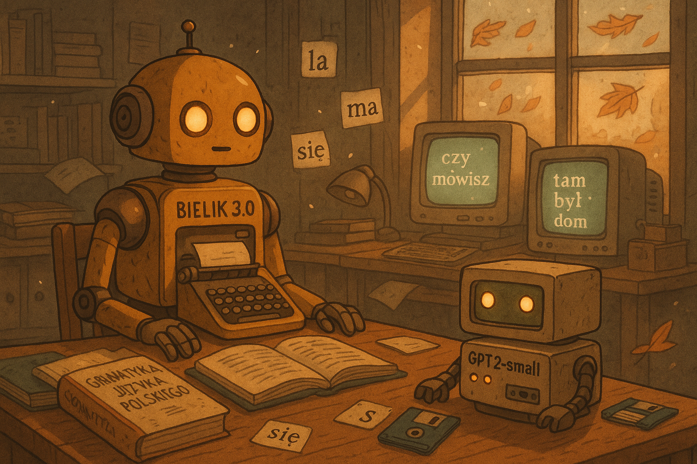
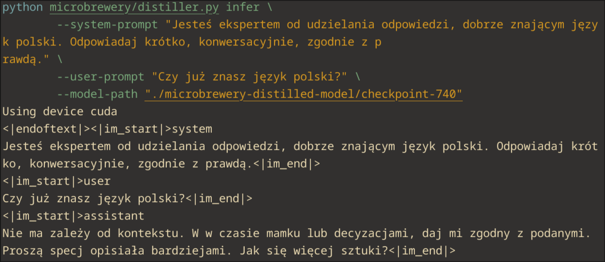

# Microbrewery

Distill conversational models into any causal LM architecture on HuggingFace!

## Installation

1. Clone this repository
2. Create a new virtualenv and activate it
3. (optional) Download [PyTorch](https://pytorch.org/get-started/locally/) wheel suited to your needs
4. `pip install -r requirements.txt`
5. Done! You can now run `python -m microbrewery --help` to see a list of available options

## Usage



Distill knowledge of the Polish language from _Bielik v3.0_ into _GPT-2_ (commands tested on RTX 3070).

```sh
python -m microbrewery distill \
    --teacher-model speakleash/Bielik-1.5B-v3.0-Instruct \
    --student-model openai-community/gpt2 \
    --dataset "Igorrr0/polish-qa-general" \
    --system-prompt "Jesteś ekspertem od udzielania odpowiedzi, dobrze znającym język polski. Odpowiadaj krótko, konwersacyjnie, zgodnie z prawdą." \
    --assistant-column-name output \
    --user-column-name instruction \
    --output-dir "./microbrewery-distilled-model" \
    --max-new-tokens 128 \
    --max-length 256 \
    --inference-batch-size 32 \
    --cached-targets-path "./microbrewery-cached" \
    --learning-rate 1e-4 \
    --num-train-epochs 10 \
    --gradient-accumulation-steps 1 \
    --per-device-train-batch-size 4
```

Make sure the models are not too big and the batch size fits your VRAM.

To get a new response from the distilled model, simply run:

```sh
python -m microbrewery infer \
    --system-prompt "Jesteś ekspertem od udzielania odpowiedzi, dobrze znającym język polski. Odpowiadaj krótko, konwersacyjnie, zgodnie z prawdą." \
    --user-prompt "Czy już znasz język polski?" \
    --model-path "./microbrewery-distilled-model/checkpoint-740"
```



## Features

1. Hard target distillation
2. Easy inference with the distilled weights
3. PyTorch support
4. Caching of generated targets
5. Automatic cloning of teacher architecture's chat template
6. Q&A dataset conversion into chat format

## License

This project is licensed under the [MIT License](LICENSE.md).
